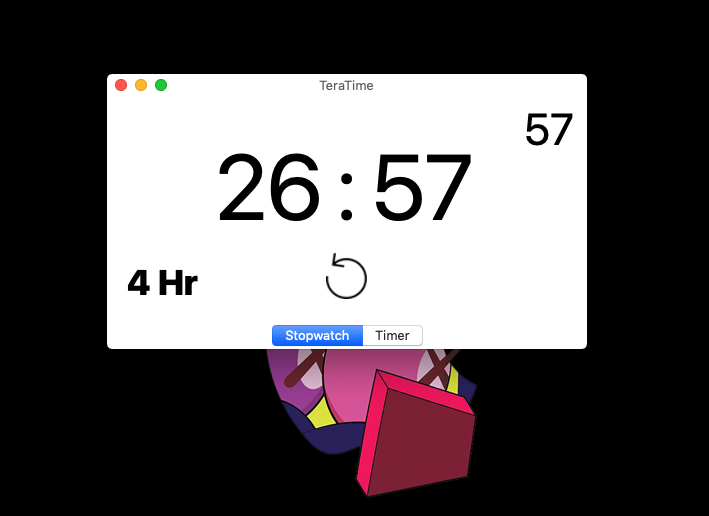

# Moddtech Exam

. The App is to display concerts that are available on the API of Ticketmaster and search it by artist. 🎧 🎤

## Instructions

. Need to install the dependencies for the project (Cocoapods):

```
cd project
pod install
```

. And ready to go!

#### Expected Time

. To build this app I expect a limit of **4 hours maximum** to build it. (I'm writing this before building the app, so let's get to work! 📱).

#### Reality

. The final time to finish the App was: **4 Hours and 27 Minutes** (plus the time that I'm writing this) 😅.



#### Features to add in the future

- Design a better prototype for UI and UX.
- Display more information of the artist on **DetailsVC** (Dates, Location, etc.)
- So we need to read more about the API of Ticketmaster to pull that info.
- Safe the date on the calendar of our iPhone.
- Add a WebView if you want to visit the Ticketmaster website of the artist to not leave the app.
- Add another **TableViewVC** when you're searching the artist to display it better to the user.
- Add a MapView to display the option to see the location of the concert.
- **Important**: Clean the code much as possible.
